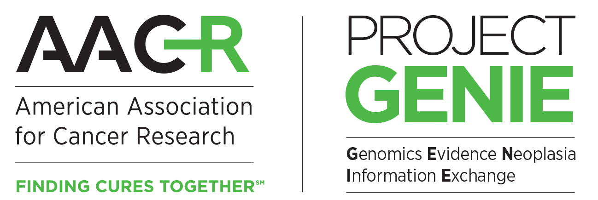

# GENIE BPC Bladder Cancer Landscape Manuscript



# Overview

An initial descriptive analysis of AACR's [GENIE BPC](https://www.aacr.org/professionals/research/aacr-project-genie/bpc/) bladder cancer cohort.  This repo contains only the analysis portions completed by Sage Bionetworks (originally Alex Paynter).

# Installation and Setup

To clone this repository, run the following in the command line from a machine with git installed:

```
git clone https://github.com/Sage-Bionetworks/genie-bpc-bladder-landscape-manu
```

## Reproducibility tools

This repository:
- Was tested and run on R version 4.4.2.
- Uses R projects.  When running any codes, please open the `.RProj` file first.  
- Does **not** use `renv` to manage package environments.
- Does **not** use `docker` or other containerization to manage deployment.

The code may work without appreciation of these tools, but no guarantees.

## Requirements

To run the code in this respository you will need:

- A Synapse account which has download rights for GENIE data.  See below on data versions.
- The [synapser](https://r-docs.synapse.org/articles/synapser.html) R package, which will also require a python installation (follow instructions at that link).
	- *Note:*  This is only used to acquire the data.  It is technically possible to download the data by pointing and clicking if you want to.

# Code structure

The top-level workflow of the project is in `main.R`.  This calls the other analysis scripts in the correct sequence to reproduce my workflow.  Other top level folders include:

- `/analysis` - Scripts (`analysis/scripts`), quarto/rmarkdown files (`analysis/reports`) and any other analysis code excluding function definitions.
- `/data-raw` - Raw data, where raw means "as it comes in the data release."
- `/data` - Processed data, saved at various stages in the analysis.
- `/output` - Figures, rendered reports, tables, etc.
- `/R` - Function definitions.  These are sometimes written with {roxygen}-style documentation like a package would be.


# Data

We use GENIE BPC Bladder release version 1.1, which is only available to GENIE consortium members.  It should have high similarity with the forthcoming  2.0-public release, expected [here](https://www.synapse.org/Synapse:syn27056172/wiki/616631) sometime in the future. 

If you are not a consortium member and you want to access the exact data version to reproduce this analysis, please send a request explaining this to genieinfo@aacr.org.

The structure, processing and flow of data is described in detail in the PDF data guide, which accompanies the data files.

# Acknowledgments/References

We wish to thank the following groups for their upstream contributions to the data:

- [AACR Project GENIE team](https://www.aacr.org/professionals/research/aacr-project-genie/about-us/)
- Sage bionetworks GENIE team - processing and releases.
- [MSKCC biostatistics team](https://www.mskcc.org/departments/epidemiology-biostatistics/biostatistics/project-genie-bpc-genomics-evidence-neoplasia-information-exchange-biopharma-collaborative)
- The patients and institutions who contributed data to the GENIE and GENIE BPC registries.

# License

The license for this material is [GNU GPLv3](https://choosealicense.com/licenses/gpl-3.0/).  That means you can use this code, as long as your code remains open for others to use.  We're on a strict honor system with no repercussions here so thanks in advance for definitely following this.

# Contact

If you have additional questions please write alexander.paynter@sagebase.org.  If that fails, try genie.dcc@sagebase.org and ask them to put you in touch with me.
